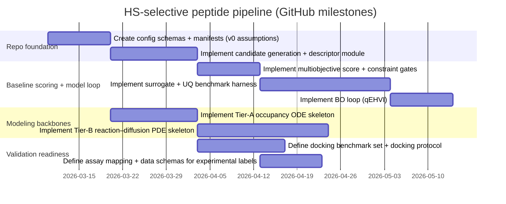

# ML‑Driven Multiscale Pipeline for HS‑Selective Peptide Design in a Simulated Neurovascular Environment

## Executive summary

A computational pipeline to design a peptide with **selective binding to heparan sulfate (HS)** in a **neurovascular (BBB/NVU) extracellular matrix (ECM) context** must be **multiscale**: molecular binding (affinity, selectivity, kinetics) is necessary but not sufficient, because the functional question is whether the peptide achieves **adequate HS site occupancy over time** under **diffusion, washout/clearance, and barrier constraints**. citeturn6search0turn8search2

Two realities drive the architecture:

- **HS is not a single structure**. HS chains vary in **sulfation pattern, uronic acid epimerization, and domain organization**, and these features alter protein/ligand interactions; rare yet biologically important motifs such as **3‑O‑sulfation** can dominate specific interactions (including anticoagulant biology). citeturn8search4turn2search3turn3search2  
- In neurovascular and neurodegenerative contexts, **HSPGs/HS can mediate binding and cellular uptake of proteopathic aggregates** (strong evidence exists for tau aggregate binding/uptake via HSPGs), so HS‑binding peptides require **explicit negative design** against misfolded aggregate panels. citeturn8search1turn8search17

A rigorous, scalable approach is a **Python‑first orchestration layer** that automates: (a) a curated HS/CS/DS oligo panel, (b) GAG‑aware docking as triage with benchmark calibration (protein–GAG docking performance varies widely across tools), (c) explicit‑solvent/ion MD refinement (salt sensitivity is central), (d) uncertainty‑calibrated ML surrogate models trained on simulation + sparse experimental kinetics labels, (e) multiobjective Bayesian optimization to maintain a Pareto frontier, and (f) a compartment or reaction–diffusion neurovascular transport model that maps kinetics into time‑dependent occupancy. citeturn3search3turn1search0turn4search3turn6search0turn7search1

Because you **do not currently have a paper**, this report treats all “paper‑provided” fields as **TBD**, supplies a **plausible default v0 input set** (explicitly labeled as assumptions), and frames implementation as a **config‑driven GitHub‑ready project skeleton** that can be updated when a real paper/spec becomes available. citeturn0search2turn0search0turn0search17

## Objectives and deliverables

### Core objectives

**Design objective:** identify peptide candidates that bind HS variants strongly enough to achieve target engagement but selectively enough to avoid broad polyanion binding (CS/DS, nucleic acids, membranes) and without driving adverse biological effects. citeturn8search4turn3search20

**System objective:** maximize **time‑dependent HS site occupancy** in a specified neurovascular compartment (glycocalyx vs vascular basement membrane vs perivascular space), accounting for diffusion and clearance. BBB transport modeling literature emphasizes that delivery/uptake is governed by transport mechanisms and can be represented with mathematical (compartment/vessel) models that couple kinetics and transport. citeturn6search0turn8search2

**Negative design objective:** minimize binding/adsorption to misfolded aggregates (e.g., tau ± Aβ ± α‑syn), motivated by evidence that HSPGs can be critical mediators of aggregate binding/uptake (tau aggregates in particular). citeturn8search1turn8search21

### Hard constraint gates

- **BBB/NVU safety gate:** no barrier integrity compromise (TEER/permeability non‑worsening), with TEER measurement known to be highly sensitive to technical parameters and requiring standardized reporting. citeturn2search4  
- **Anticoagulant‑risk gate:** explicitly avoid unintended interactions with anticoagulant HS/heparin motifs; 3‑O‑sulfated glucosamine is key to high‑affinity antithrombin binding and anticoagulant biology, so motifs/variants containing 3‑O‑sulfation should be included in screening as “do‑not‑engage” negatives (unless the therapeutic mechanism intends otherwise). citeturn3search2turn2search3  
- **Developability gate:** reduce peptide self‑aggregation and insolubility using established predictors (TANGO, AGGRESCAN, CamSol) as first‑pass filters before expensive modeling; these tools are widely cited for aggregation/solubility screening. citeturn5search0turn5search1turn5search6  
- **Toxicity gate (computational filter):** use an explicit toxicity/hemolysis risk predictor as a screening penalty (not a substitute for wet lab), supported by literature demonstrating modern sequence+structure ML toxicity models. citeturn6search5  

### Deliverables appropriate for a GitHub README

- A **config‑driven pipeline** that generates candidate peptides, computes sequence descriptors, runs multi‑fidelity scoring (cheap → expensive), trains a surrogate with uncertainty, and proposes next candidates via multiobjective Bayesian optimization. citeturn1search3turn4search3turn7search1  
- Reproducible **data manifests** and versioned panels for HS/CS/DS oligos, off‑target proteins, and aggregate structures using programmatic access to primary/official sources. citeturn0search0turn0search17turn0search2  

## Inputs and recommended default starting set

### Inputs that must be extracted from the user’s paper

The following are **TBD until a paper/spec exists** and should be represented as required fields in configuration files:

- Peptide sequence(s), modifications, length bounds, prohibited residues/chemistries  
- Target neurovascular compartment and access route (luminal vs abluminal)  
- Target HS structural hypothesis (which sulfation motifs and chain lengths matter)  
- Required concentration and exposure time scales for modeling and assays  
- Intended mechanism (competition/displacement vs blockade of aggregate docking vs occupancy thresholding)

These are not “nice to have”; they determine HS panel composition, modeling geometry, and evaluation metrics. citeturn8search4turn8search2turn6search0

### Recommended default v0 inputs for initial computational work

Everything below is an **assumption** meant to enable early pipeline development and benchmarking; replace once a real paper/spec exists.

#### Candidate peptide sequences and variants

Net charge is shown as an **approximate integer** assuming Lys/Arg = +1, Asp/Glu = −1, and His treated as ~0 at pH 7.4 (a simplification suitable for early screening but not for final electrostatics). *(Assumption.)* citeturn8search7

| ID | Sequence | Length | Approx. net charge | Modifications | Rationale (assumption) |
|---|---:|---:|---:|---|---|
| PaperLead‑1 | **TBD (from paper)** | TBD | TBD | TBD | Replace with paper-defined lead(s). |
| P1 | AKRKRQGK | 8 | +5 | none | Short HS‑binding motif seed with polar spacer (Q) to reduce pure charge clustering. |
| P2 | GRRGRKQK | 8 | +5 | none | Similar charge with altered spacing; probes sensitivity to motif ordering. |
| P3 | KRGKRRQA | 8 | +5 | none | Adds alanine spacer; tests compact basic patch behavior. |
| P4 | RRKQGRKR | 8 | +6 | none | Slightly higher charge density; use as “too sticky?” control. |
| P5 | AKKQKAKKQKAKKQKA | 16 | +9 | none | Longer repeat with spaced basics; stresses selectivity and uptake risk penalties. |
| P6 | GKKRGRRKRRK | 11 | +9 | none | Dense basic cluster positive control for HS affinity but high off‑target risk. |
| P7 | RKRGRQKRRKA | 11 | +8 | none | Similar charge with polar insertions for tunable binding. |
| P8 | GKRRKAKRGRR | 11 | +8 | none | Alternating K/R blocks; tests electrostatic patterning effects. |
| P9 | KRGRRKQKRGR | 11 | +8 | none | Basic‑rich motif with Q spacer to reduce nonspecific adsorption. |
| P10 | GKKRGKKEGKKRGK | 14 | +8 | none | Introduces single acidic residue (E) to probe specificity vs “global polyanion binding.” |
| P11 | GKKQGKQEGKKQGKQ | 15 | +5 | none | Moderate charge; tests whether lower charge can preserve HS selectivity. |
| P12 | GHHKHKQKHKQKHKQK | 16 | +7 | none | Histidine‑rich pH‑tunable design (screen across pH as needed). |
| P13 | GSSGSSGSSGSSGSS | 15 | 0 | none | Neutral negative control for nonspecific adsorption and assay baselines. |
| P14 | AKRGRKRRKQGA | 12 | +7 | none | Mid‑length candidate; balanced charge and spacing. |
| P15 | AKRKRGRRKQGAKR | 14 | +9 | none | Higher charge mid‑length candidate for Pareto tradeoff tests. |
| P16 | AKRGRKQKRRQGAKRGRK | 18 | +11 | none | Long, high-charge “upper envelope” stress test (should be penalized by safety/selectivity). |
| P17 | AKRGRQKQERKQGRQKQERK | 20 | +8 | none | Longer candidate with acidic residues controlling nonspecific binding. |

**Why motif lengths can be short but peptides must be longer:** empirical motif descriptions (e.g., Cardin–Weintraub consensus patterns) identify short basic patterns, but binding specificity depends on 3D presentation, spacing, and context; reviews reiterate that motifs are useful heuristics, not guarantees of specificity. citeturn8search7turn8search3

#### HS/CS/DS oligo panel

Because IDs depend on exact structures, the **GlyTouCan accession IDs are marked TBD and should be resolved programmatically** during data ingestion by registering or querying precise WURCS strings. citeturn0search2turn0search14

| Internal ID | GlyTouCan accession | GAG class | Length (dp) | Sulfation pattern | Rationale |
|---|---|---|---:|---|---|
| HS‑dp4‑NAc | TBD | HS | 4 | no sulfation (heparosan‑like) | Negative control for “charge‑driven” binding. |
| HS‑dp4‑NS | TBD | HS | 4 | N‑sulfation only | Minimal sulfation motif; tests N‑S dependence. |
| HS‑dp4‑NS‑2S | TBD | HS | 4 | N‑S + 2‑O‑S | Probes IdoA2S‑linked binding preference. |
| HS‑dp4‑NS‑6S | TBD | HS | 4 | N‑S + 6‑O‑S | Probes 6‑O‑S–driven binding preferences. |
| HS‑dp6‑mixed | TBD | HS | 6 | mixed GlcA/IdoA and mixed sulfation | Representative HS heterogeneity (not heparin‑like). |
| Heparin‑dp6‑highS | TBD | heparin (Hp) | 6 | highly sulfated (Hp‑like) | High-affinity positive control; known to differ structurally from HS and may overestimate binding. citeturn3search5 |
| HS‑dp5‑AT‑motif | TBD | HS | 5 | includes 3‑O‑sulfation | Anticoagulant‑risk sentinel; 3‑O‑S is key for antithrombin binding. citeturn3search2turn2search3 |
| CS‑A‑dp4 | TBD | CS | 4 | GalNAc4S dominant (CS‑A) | Negative panel for selectivity. citeturn8search16 |
| CS‑C‑dp4 | TBD | CS | 4 | GalNAc6S dominant (CS‑C) | Tests sulfation‑position sensitivity. citeturn8search16 |
| CS‑E‑dp4 | TBD | CS | 4 | GalNAc4S6S (CS‑E) | Highly sulfated CS negative; detects “high sulfate = bind” failure modes. |
| DS‑dp4 | TBD | DS | 4 | IdoA + GalNAc4S | DS negative; tests iduronate‑driven conformational effects. citeturn8search16 |

#### Neurovascular compartments and ECM components

The vascular basement membrane is described as a network primarily composed of **laminin, collagen IV, nidogen, and heparan sulfate proteoglycans**, and it supports interactions between brain endothelial cells, pericytes, and astrocyte endfeet—making it a biologically grounded target compartment for HS‑mediated interventions. citeturn8search2

| Compartment | Cell types present | Core ECM components (assumption) | HS accessibility | Modeling notes |
|---|---|---|---|---|
| Blood lumen | none | none | indirect | Include convection/washout boundary if flow is modeled. |
| Endothelial luminal glycocalyx | brain endothelial cells | HSPGs + glycocalyx matrix | high | Screen uptake/internalization risk because HS/HSPGs can mediate binding and entry for cationic cargos. citeturn8search1 |
| Endothelial barrier layer | brain endothelial cells | tight junction system + basal lamina interface | moderate | Parameterize permeability using TEER/permeability constraints. citeturn2search4 |
| Vascular basement membrane | endothelium + pericytes + astrocyte endfeet adjacency | laminin, collagen IV, nidogen, HSPGs (perlecan/agrin) | high | Prime site for diffusion‑limited binding; model fixed binding sites + diffusion in ECM. citeturn8search2 |
| Perivascular space | astrocytes + pericytes nearby | interstitial ECM | variable | Apply safety constraints for unintended parenchymal exposure. citeturn6search0 |

### Default concentration/time scale assumptions

Because you requested “no invented values,” the repo should store these as **configurable priors** rather than hard-coded constants. For a v0 computational project, a reasonable practice is to define **log‑spaced concentration grids** and simulate **minutes→hours** occupancy under a small set of clearance regimes; BBB transport modeling literature supports using mechanistic models with parameter estimation rather than fixed universal constants. citeturn6search0

## Modeling scope and computational methods

### Molecular modeling stack

**Docking (triage):** protein–GAG docking performance is highly tool‑dependent; a benchmarking study evaluated eight docking programs on 28 protein–GAG complexes and motivates using docking primarily to generate poses and hypotheses, not as final rankers. citeturn3search3

**GAG‑aware docking:** specialized methods like **GAG‑Dock** were developed/validated for predicting poses of protein‑bound GAGs, providing a better starting point than generic docking for sulfated polysaccharides. citeturn3search0

**Atomistic MD refinement:** explicit salt/water MD is central because electrostatics and ion pairing dominate GAG interfaces; MD setup for glycans is supported by **CHARMM‑GUI Glycan Modeler**, and engine choice can be Python‑controlled with high performance via OpenMM. citeturn4search4turn1search0

**Force field and sulfate/ion pairing sensitivity:** sulfated groups and counter‑ion interactions can be force‑field sensitive; published work extends GLYCAM parameters for heparin‑like GAGs and benchmarks sulfate/sulfamate parameterization and ion pairing behavior. citeturn4search1turn4search2

**Heparin ≠ HS:** solution scattering studies conclude that HS adopts conformations significantly distinct from heparin (HS can be longer/more bent and shows different flexibility), so relying on heparin alone can bias binding expectations. citeturn3search5

**Enhanced sampling / kinetics (finalists):** add enhanced sampling when unbinding/binding events are rare on standard MD timescales; reviews cover umbrella sampling/metadynamics families, and weighted ensemble methods are reviewed for rare-event kinetics estimation. citeturn4search13turn2search2turn3search15

image_group{"layout":"carousel","aspect_ratio":"16:9","query":["heparan sulfate sulfation pattern diagram","vascular basement membrane laminin collagen IV nidogen heparan sulfate proteoglycans schematic","blood brain barrier neurovascular unit schematic"],"num_per_query":1}

### Neurovascular transport and occupancy modeling

A recommended progression is:

- **Tier A (compartment ODE):** fast sweeps for identifiability and “which parameter matters?” reasoning. citeturn6search0  
- **Tier B (1D reaction–diffusion PDE):** vessel wall thickness direction with fixed binding sites, diffusion, and clearance; enables prediction of gradients and diffusion-limited binding regimes. citeturn6search0turn1search1  
- **Tier C (optional ABM/3D):** if heterogeneous ECM patches or cell remodeling are central, use agent-based modeling; PhysiCell provides an open framework for multicellular simulation with diffusion fields. citeturn1search2

### Multiscale coupling principle

The coupling mechanics should be explicit and testable:

1. Molecular binding estimates (KD/kon/koff or surrogate proxies) → effective binding parameters per HS variant. citeturn6search0  
2. Transport model uses these parameters to compute **HS occupancy vs time** in the target compartment under diffusion/clearance. citeturn6search0  
3. Optimization loop targets occupancy and selectivity simultaneously (multiobjective scoring).

### Candidate method comparison

| Method family | Primary question answered | Strengths | Key failure modes | When to use |
|---|---|---|---|---|
| Docking (benchmark‑calibrated) | pose hypotheses | high throughput | unreliable rank ordering for flexible, highly charged GAGs citeturn3search3 | early triage |
| GAG‑Dock (specialized) | GAG pose prediction | validated on GAG complexes citeturn3search0 | still needs calibration to your chemistry | early–mid |
| Atomistic MD | stability + ion/water mediation | salt/solvent realism; mechanistic features citeturn1search0turn4search2 | sampling cost; force-field sensitivity citeturn4search1 | refinement |
| Enhanced sampling / WE kinetics | ΔΔG and/or rates | resolves rare events citeturn4search13turn2search2 | method complexity | finalists |
| Reaction–diffusion PDE | occupancy over time | interpretable, scalable; sensitivity analysis citeturn1search1 | parameter identifiability | always |
| Agent‑based (PhysiCell) | heterogeneity, cell behaviors | emergent spatial effects citeturn1search2 | parameter explosion | only if justified |

## ML optimization loop and uncertainty management

### ML tasks and model classes

**Sequence → property predictors:** predict HS affinity proxy, HS vs CS/DS selectivity, aggregate-binding penalty, and developability/toxicity filters. Aggregation predictors (TANGO, AGGRESCAN) and solubility predictors (CamSol) are established choices for large-scale filtering. citeturn5search0turn5search1turn5search6

**Transfer learning:** use protein language model representations; ESM‑2 demonstrates strong sequence-to-structure signal capture at scale, and PLMFit benchmarks transfer learning strategies for protein engineering. citeturn5search3turn6search2

**Generative models:** use constrained generation rather than unconstrained sequence sampling; if you later incorporate structure context, ligand/context-conditioned design methods (e.g., LigandMPNN) support conditioning on non-protein components—conceptually relevant to peptide–HS contexts (though HS is a polymeric ligand). citeturn6search19

### Active learning and Bayesian optimization

Bayesian optimization is appropriate because experimental labels (SPR kinetics, selectivity panels, TEER/permeability) are expensive; BoTorch provides an efficient MC-based BO framework, and qEHVI provides a practical acquisition function for parallel, constrained multiobjective optimization. citeturn1search3turn4search3

### Uncertainty quantification

Uncertainty must be evaluated, not assumed. A benchmark study on uncertainty quantification methods for protein engineering evaluates UQ methods on FLIP tasks and assesses utility under distribution shift and for active learning/optimization. citeturn7search1turn7search2

### Suggested Pareto trade-off plots (no data required)

Design Pareto charts around decisions you actually need to make:

- HS affinity proxy vs HS/CS selectivity proxy  
- HS affinity proxy vs aggregate-binding penalty (tau panel)  
- Predicted HS occupancy time-above-threshold vs TEER/permeability risk penalty  
- Residence time proxy (1/koff) vs washout sensitivity (from transport model)

These make “best peptide” a transparent multiobjective argument rather than a single-score gamble. citeturn4search3turn6search0

## Data sources, evaluation metrics, and validation strategy

### Priority data sources

Use primary/official sources as the backbone:

- entity["organization","RCSB Protein Data Bank","structure database"] APIs (Search/Data) for structures, ligands, and metadata. citeturn0search0turn0search4turn0search8  
- entity["organization","UniProt Knowledgebase (UniProtKB)","protein sequence database"] API endpoints for protein sequences and annotations. citeturn0search17turn0search1  
- entity["organization","GlyTouCan","international glycan repository"] for stable glycan accessions and WURCS-encoded structure registration/query. citeturn0search2turn0search14  
- entity["organization","GlyGen","glycoinformatics knowledgebase"] for integrated glyco/protein relationships and harmonized metadata. citeturn0search3

#### Data source comparison table

| Source | What to pull | Why it matters | Practical note |
|---|---|---|---|
| PDB APIs | protein–GAG complexes, fibrils/aggregates | benchmarking + negative design structures citeturn0search0 | prefer API-based manifests for reproducibility citeturn0search4 |
| UniProtKB APIs | sequences/annotations of HS-binding proteins | build off-target protein panels citeturn0search17 | store accessions + versioned query results |
| GlyTouCan | accession IDs + WURCS | standardize HS/CS/DS library citeturn0search2 | resolve IDs programmatically from exact structures |
| GlyGen | integrated glyco/protein metadata | faster joins and curated context citeturn0search3 | use as enrichment layer, not sole truth |

### Evaluation metrics

Minimum viable metric suite:

- **Affinity/selectivity:** KD (or proxies) across HS panel and CS/DS panel (ratio/ΔΔG). citeturn8search4turn8search16  
- **Kinetics:** kon/koff and derived residence time; critical for occupancy under washout. citeturn6search0  
- **Aggregate binding penalty:** adsorption/binding against tau aggregate panels (and others if specified). citeturn8search1turn8search21  
- **Developability:** aggregation propensity and solubility metrics (TANGO, AGGRESCAN, CamSol). citeturn5search0turn5search1turn5search6  
- **Safety proxies:** TEER/permeability penalty; aPTT penalty; MMP interference penalty. citeturn2search4turn2search1turn2search2  
- **System-level:** simulated HS site occupancy vs time (time above threshold). citeturn6search0

### Validation assays and what they calibrate

| Assay | Primary output | Pipeline component calibrated | Notes |
|---|---|---|---|
| SPR | kon/koff/KD | molecular kinetics + surrogate ground truth | supports transport model parameterization citeturn6search0 |
| Displacement assay | competition curves | mechanism validation | confirms “competitive occupancy” hypothesis |
| GAG selectivity panel | HS vs CS vs DS ratio | selectivity metric | prevents “polyanion binder” winners citeturn8search16 |
| TEER/permeability | barrier integrity | BBB safety and permeability parameters | TEER is sensitive to setup; follow critical review guidance citeturn2search4 |
| Cytokine panels | inflammatory activation | immunotoxicity gate | interpret with NVU model choice |
| aPTT | coagulation impact | anticoagulant-risk gate | PTT reflects intrinsic/common pathways; used clinically to assess coagulation citeturn2search1 |
| MMP activity assay | protease activity change | protease interference gate | fluorogenic peptide substrate methods are standard citeturn2search2 |
| Aggregate-binding assay | adsorption/colocalization | negative design objective | motivated by HSPG-mediated tau uptake evidence citeturn8search1 |

## Implementation plan for GitHub, compute, and milestones

### Python-first implementation guidance

Python-first is the correct default because: (a) primary data ingestion is API-driven, (b) BO/UQ stacks are Python-native, and (c) major simulation/PDE stacks provide Python entry points with optimized backends. citeturn0search0turn1search0turn1search1turn1search3turn7search1

Suggested repo backbone (README-friendly):

- `configs/` (all assumptions and paper-derived values live here)
- `data/manifests/` (versioned panels: HS/CS/DS, off-target proteins, aggregate structures)
- `peptides/` (candidate generation + filtering + descriptors)
- `scoring/` (multi-fidelity scoring wrappers; objective function)
- `models/` (ML surrogates, UQ, BO)
- `transport/` (Tier A ODE, Tier B PDE specs)
- `reports/` (figures, Pareto plots, run summaries)
- `tests/` (unit tests for configs, descriptors, filtering)
- `docs/` (assumptions and decision logs)

### Compute requirements (expressed as scalable constraints)

- Docking: CPU-parallel; scale with candidates × oligos; calibrate using protein–GAG docking benchmarks before trusting scores. citeturn3search3  
- MD: GPU recommended; explicit salt/water; allocate additional budget for sulfate/ion pairing sensitivity tests. citeturn1search0turn4search2  
- PDE/ODE (Tier A/B): lightweight compared to MD; suitable for large sweeps and sensitivity analyses. citeturn1search1turn6search0

### Mermaid architecture diagram

```mermaid
flowchart LR
  A[Spec config: paper-derived fields or v0 assumptions] --> B[HS/CS/DS panel manifest]
  A --> C[Peptide generator + filters]
  B --> D[Docking triage + pose set]
  C --> D
  D --> E[MD refinement + features]
  E --> F[Optional enhanced sampling/kinetics (finalists)]
  E --> G[Surrogate models + UQ]
  F --> G
  G --> H[Multiobjective BO (qEHVI) under constraints]
  H --> C
  E --> I[Transport/occupancy model (ODE/PDE)]
  I --> J[Pareto ranking + gates]
  J --> K[Assay batch selection]
  K --> G
  K --> I
```

### Mermaid Gantt timeline (GitHub milestone oriented)



### Granular 1–2 hour GitHub tasks (checklist)

- [ ] Create `configs/spec.yaml` with required fields and explicit “TBD from paper” placeholders.  
- [ ] Create `configs/assumptions.yaml` documenting every default assumption and its replacement plan.  
- [ ] Create `data/manifests/hs_panel.yaml` with the v0 HS/CS/DS internal IDs and “GlyTouCan accession = TBD.” citeturn0search2  
- [ ] Create `data/manifests/off_targets_uniprot.yaml` containing a list schema for UniProt accessions and selection rationale. citeturn0search17  
- [ ] Create `data/manifests/aggregates_pdb.yaml` containing a list schema for PDB IDs and negative design priority. citeturn0search0  
- [ ] Add a `README.md` section explaining why HS heterogeneity requires a variant panel (not a single HS). citeturn8search4  
- [ ] Implement a peptide record schema that stores sequence, length, estimated net charge, and flags.  
- [ ] Implement a descriptor module that computes length, residue counts, and net charge (simple model).  
- [ ] Implement filters rejecting sequences above a configured max net charge.  
- [ ] Implement filters rejecting sequences with long hydrophobic runs (configurable threshold).  
- [ ] Store candidate peptides in a versioned artifact file `data/candidates/v0_candidates.*` with provenance fields.  
- [ ] Implement a multiobjective score data model that stores per-objective outputs and constraint violations.  
- [ ] Implement “hard gate” logic that marks candidates invalid when any safety gate fails.  
- [ ] Implement “soft penalty” logic for ranking without exclusion (e.g., moderate uptake risk).  
- [ ] Write unit tests for config loading and schema validation.  
- [ ] Write unit tests for net charge and descriptor correctness on a small fixed set of sequences.  
- [ ] Define a docking benchmark manifest format for protein–GAG complexes (PDB IDs + ligand length metadata). citeturn3search3  
- [ ] Add a markdown note describing why docking scores are not trusted without benchmarking in GAG systems. citeturn3search3turn3search0  
- [ ] Define an MD run configuration schema that stores ion conditions and force-field choice as parameters. citeturn4search2turn4search1  
- [ ] Create a placeholder “MD feature schema” listing which trajectory features will be extracted.  
- [ ] Create `transport/ode_spec.md` describing compartments, fluxes, and binding reactions (Tier A). citeturn6search0  
- [ ] Create `transport/pde_spec.md` describing variables, boundary conditions, and binding sinks (Tier B). citeturn1search1turn6search0  
- [ ] Implement a results schema for occupancy curves (time grid + occupancy + summary metrics).  
- [ ] Add a document describing TEER/permeability as a hard gate and the need for standardized measurement. citeturn2search4  
- [ ] Add a document describing why 3‑O‑sulfation motifs are anticoagulant-risk sentinels. citeturn3search2turn2search3  
- [ ] Add an assay mapping table in `docs/assay_mapping.md` linking each assay to model parameters. citeturn2search1turn2search2turn2search4  
- [ ] Implement a baseline surrogate training harness that saves model + metrics + predictions + uncertainties. citeturn7search1  
- [ ] Add a UQ benchmarking notebook/spec modeled after protein engineering UQ benchmark practice. citeturn7search1turn7search2  
- [ ] Implement a BO loop wrapper that can accept multiple objectives and constraints (qEHVI planned). citeturn4search3turn1search3  
- [ ] Create `reports/pareto_specs.md` defining the first Pareto plots and their axes before running optimization.  
- [ ] Add CI to run unit tests and config validation on every push.  
- [ ] Create GitHub issue templates for “feature,” “experiment,” and “bug” to keep the repo organized. entity["company","GitHub","code hosting platform"]  
- [ ] Run an end-to-end dry run on 10 candidates through generation → descriptors → filtering → scoring schemas and confirm artifacts are produced.

